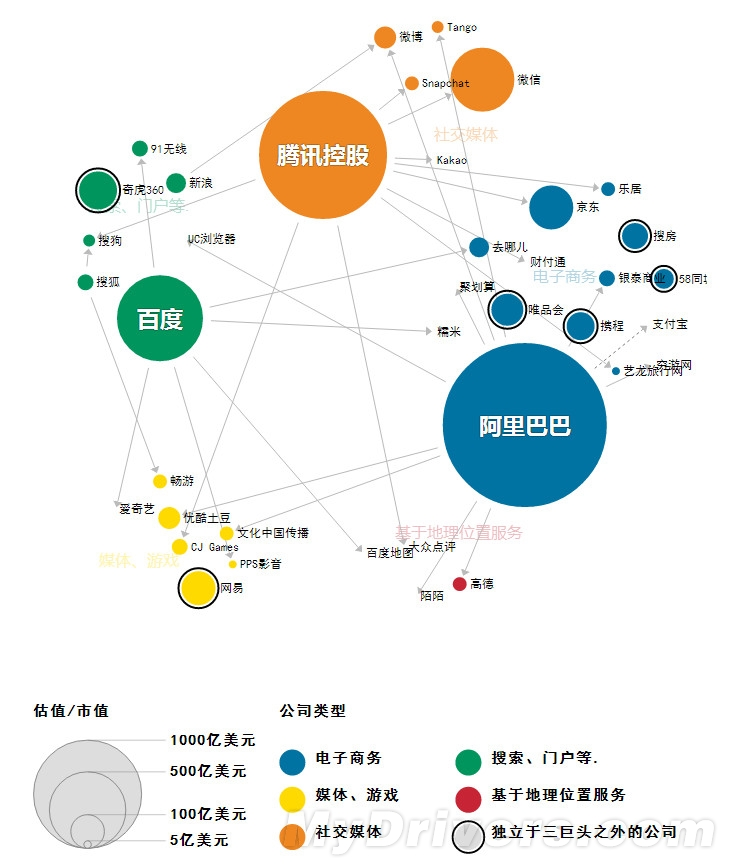

# 1. On Experience

## 1.1 Baidu

### 1.1.1 Cloud
**Q1: Why Baidu develop Cloud** 
- Tech side: easy
  Ready-made team and product and Technology
  
- Business side: tough
  **Downside/Disadvange/Weakness**
  Baidu is not first-mover in this market. is a new comer.
  Ali, Tensent, JinSan Cloud, not mention Amazon, Azure, Google, Oracle, IBM, etc

  Chief director FXJ made a business report to Robin a few month ago.
  Robin didn't think 2B Cloud has Broad Prospects
  
  Defensive weapon, not offensive weapon
  **Ecosystem**
  - Spin-Off
  - Digital Marketing: Build website, Searching Engine Optmizaiont, SE Marketing, Big data analysis helpint them to improve PPC.
  - Online Education: Coursera, Andrew Ng, CSDN. is hot area of investment.
  - Govenment and state-owned enterprises.
  
  We are confident in capturing a comparably large market share in this 4 area. Especially the top three, this is our influence region. We expect handreds of million RMB revenue per years. 

**Cloud Ecosystem**
- Tencent: 
  Game live-broadcast, is strong, 
- Ali:
  E-Commerse, 

### 1.1.2 Media Services

courtroom trial of Kuaibo. totally 1 million persions watching  and 40K concurrent watch the live broadcast.
was charged internet infringement, publish video/audio content without license.

### 1.1.3 Palyer SDK

Challenges in Mobile Context
•  Unreliable Network 
•  Limited Hardware 
•  Battery Limit
•  User SenMment
•  Worldwide Users
•  Device/OS Diversity

## 1.2 Oracle

### 1.2.2 Visualization on App Server

### 1.2.1 JavaEE / GlassFish / WebLogic

## 1.3 Nortel

## 1.4 HW

## 1.5 PKU / SDU

